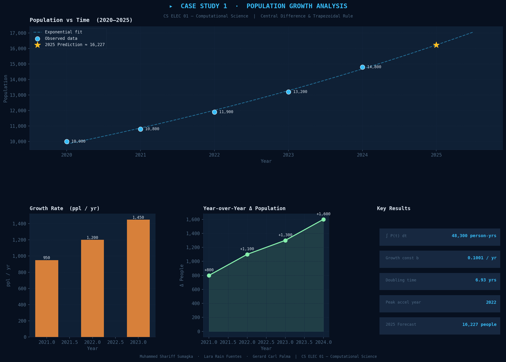
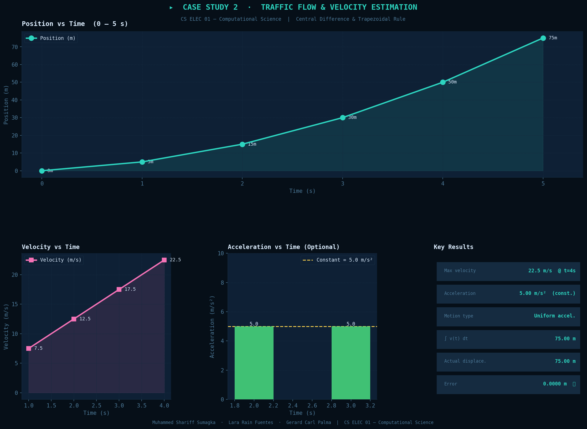
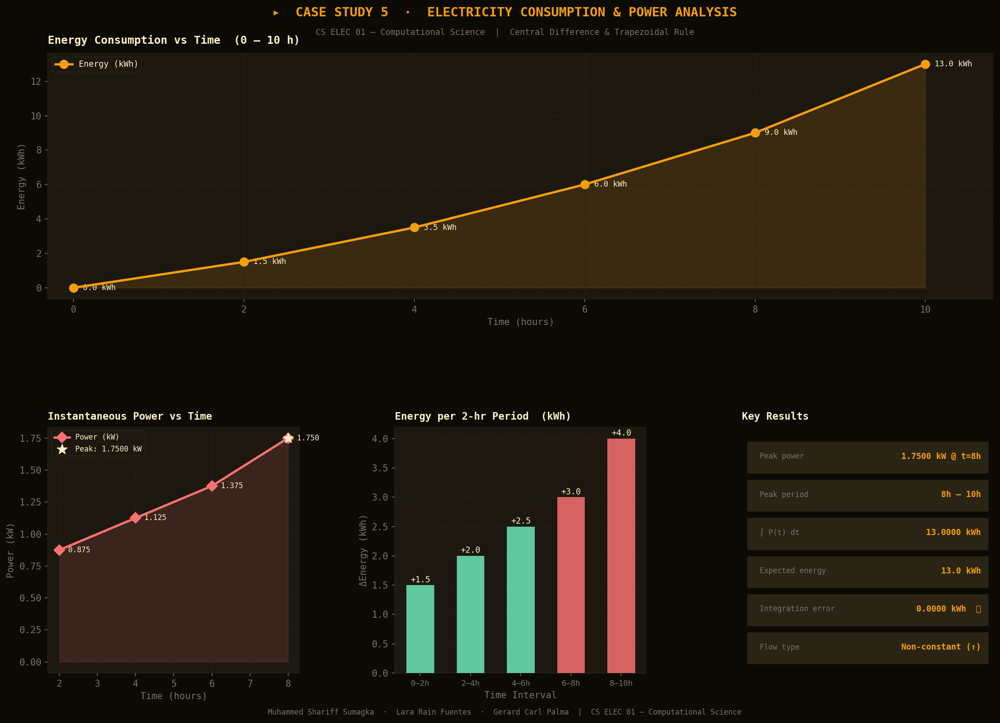

<div align="center">

# Numerical Methods Case Studies
### CS ELEC 01 — Computational Science
#### Finals Activity 1

**College of Engineering and Information Technology**
Department of Computing and Library Information Science

---


</div>

---

## About

This repository contains Python solutions for three numerical methods case studies selected from Finals Activity 1. Each case study applies **numerical differentiation** and **numerical integration** to analyze real-world discrete data — without relying on a known continuous function.

The three case studies covered are:

| # | Topic | Methods Used |
|---|-------|-------------|
| 1 | Population Growth Analysis | Central Difference, Trapezoidal Rule, Exponential Regression |
| 2 | Traffic Flow & Velocity Estimation | Central Difference, Trapezoidal Rule |
| 5 | Electricity Consumption & Power Analysis | Central Difference, Trapezoidal Rule |

---

## Group Members

| Name |
|------|
| Muhammed Shariff Sumagka |
| Lara Rain Fuentes |
| Gerard Carl Palma |

---

## Repository Structure

```
cs-elec01-finals-activity1-group6/
│
├── case_study_1_population.py      # Case Study 1 solution
├── case_study_2_traffic.py         # Case Study 2 solution
├── case_study_5_electricity.py     # Case Study 5 solution
│
├── case1_population.png            # Output chart – Case 1
├── case2_traffic.png               # Output chart – Case 2
├── case5_electricity.png           # Output chart – Case 5
│
├── README.md
├── .gitignore
└── LICENSE
```

---

## Numerical Methods Reference

### Central Difference Method
Used to estimate the **derivative** (rate of change) at a point from discrete data.

```
f'(xᵢ) ≈ [ f(xᵢ₊₁) − f(xᵢ₋₁) ] / 2
```

> Only applicable at interior points — endpoints are skipped because they lack a value on one side.

### Trapezoidal Rule
Used to estimate the **definite integral** (total accumulated value) from discrete data.

```
∫ f(x) dx ≈ (h/2) × Σ [ f(xᵢ) + f(xᵢ₊₁) ]
```

> Approximates the area under a curve by connecting data points with straight lines (trapezoids) and summing their areas.

---

## Case Studies

---

### Case Study 1 — Population Growth Analysis

**File:** `case_study_1_population.py`

#### Scenario
A local government only has yearly population records. The goal is to determine how fast the population is growing and forecast where it is headed.

#### Given Data

| Year | Population |
|------|-----------|
| 2020 | 10,000 |
| 2021 | 10,800 |
| 2022 | 11,900 |
| 2023 | 13,200 |
| 2024 | 14,800 |

#### Process

**Step 1 — Growth Rate (Central Difference)**

Applied at interior years (2021, 2022, 2023):

| Year | Growth Rate (ppl/yr) |
|------|---------------------|
| 2021 | 950 |
| 2022 | 1,200 |
| 2023 | 1,450 |

**Step 2 — Total Cumulative Population (Trapezoidal Rule)**

```
∫₂₀₂₀²⁰²⁴ P(t) dt  ≈  48,300 person-years
```

**Step 3 — Exponential Model & 2025 Forecast**

Fitted model: `P(t) = 9,838.37 × e^(0.1001t)` where `t = year − 2020`

| Parameter | Value |
|-----------|-------|
| Growth constant (b) | 0.1001 / yr |
| Annual growth rate | 10.01% |
| Doubling time | 6.93 years |
| **2025 Prediction** | **≈ 16,227 people** |

#### Results & Conclusion

Population growth is **exponential**, not linear. The growth rate increased every year, accelerating most sharply in **2022** with a jump of +250 ppl/yr. If the trend holds, the population will double within approximately **7 years**. The 2025 forecast stands at **≈ 16,227 people**.

#### Visualization



---

### Case Study 2 — Traffic Flow and Velocity Estimation

**File:** `case_study_2_traffic.py`

#### Scenario
A traffic monitoring system logs a vehicle's position every second. Engineers need to calculate velocity, check for acceleration, and verify the total distance traveled.

#### Given Data

| Time (s) | Position (m) |
|----------|-------------|
| 0 | 0 |
| 1 | 5 |
| 2 | 15 |
| 3 | 30 |
| 4 | 50 |
| 5 | 75 |

#### Process

**Step 1 — Velocity (Central Difference)**

Applied at interior time steps (t = 1, 2, 3, 4):

| Time (s) | Velocity (m/s) |
|----------|---------------|
| 1 | 7.50 |
| 2 | 12.50 |
| 3 | 17.50 |
| 4 | 22.50 |

**Step 2 — Acceleration (Optional Extension)**

Applying central difference again on the velocity values:

| Time (s) | Acceleration (m/s²) |
|----------|---------------------|
| 2 | 5.00 |
| 3 | 5.00 |

**Step 3 — Distance Verification (Trapezoidal Rule)**

```
∫₀⁵ v(t) dt  ≈  75.00 m
Actual displacement  =  75.00 m
Error  =  0.0000 m ✅
```

#### Results & Conclusion

The vehicle undergoes **uniform acceleration** at a constant **5.00 m/s²** throughout the trip. Motion is not uniform — velocity steadily increases from 7.5 to 22.5 m/s. The trapezoidal rule produced **zero error** compared to the actual displacement, confirming the method's accuracy on uniformly accelerating data. No anomalies or sudden jumps were detected.

#### Visualization



---

### Case Study 5 — Electricity Consumption and Power Analysis

**File:** `case_study_5_electricity.py`

#### Scenario
A household tracks energy consumption (kWh) every 2 hours. The goal is to find instantaneous power draw at each interval and verify total energy via integration.

#### Given Data

| Time (hr) | Energy (kWh) |
|-----------|-------------|
| 0 | 0.0 |
| 2 | 1.5 |
| 4 | 3.5 |
| 6 | 6.0 |
| 8 | 9.0 |
| 10 | 13.0 |

#### Process

**Step 1 — Instantaneous Power (Central Difference)**

Applied with step size `h = 2` at interior points (t = 2, 4, 6, 8):

| Time (hr) | Power (kW) |
|-----------|-----------|
| 2 | 0.8750 |
| 4 | 1.1250 |
| 6 | 1.3750 |
| 8 | 1.7500 |

**Step 2 — Total Energy Verification (Trapezoidal Rule)**

```
∫₀¹⁰ P(t) dt  ≈  13.0000 kWh
Expected total  =  13.0000 kWh
Error  =  0.0000 kWh ✅
```

#### Results & Conclusion

Electricity consumption is **non-constant and accelerating**. Power draw increases steadily throughout the day, with the highest demand in the **8h–10h** window (+4.0 kWh in 2 hours). Integration perfectly confirms the expected 13 kWh total with zero error. To reduce peak usage, heavy appliances should be shifted to off-peak hours (0–4h), and smart timers or energy-efficient devices should be considered.

#### Visualization



---

## Setup and Usage

### Requirements

- Python 3.8 or higher
- pip (Python package manager)

### Installation

Clone the repository and install dependencies:

```bash
git clone https://github.com/your-username/cs-elec01-finals-activity1-group6.git
cd cs-elec01-finals-activity1-group6
pip install numpy matplotlib scipy
```

### Running the Scripts

```bash
python case_study_1_population.py
python case_study_2_traffic.py
python case_study_5_electricity.py
```

Each script prints a full console report and opens a visualization dashboard window. The chart is also saved as a `.png` file in the same directory.

---

## References

- Burden, R. L., & Faires, J. D. (2011). *Numerical Analysis* (9th ed.). Brooks/Cole.
- Chapra, S. C., & Canale, R. P. (2015). *Numerical Methods for Engineers* (7th ed.). McGraw-Hill.
- NumPy Documentation — https://numpy.org/doc/
- Matplotlib Documentation — https://matplotlib.org/stable/

---

<div align="center">

CS ELEC 01 — Computational Science &nbsp;|&nbsp; Finals Activity 1 &nbsp;|&nbsp; AY 2025–2026

</div>
